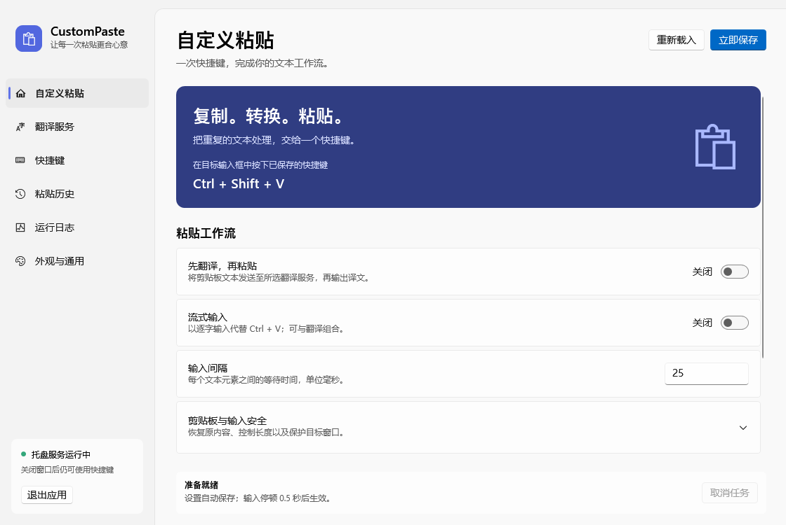
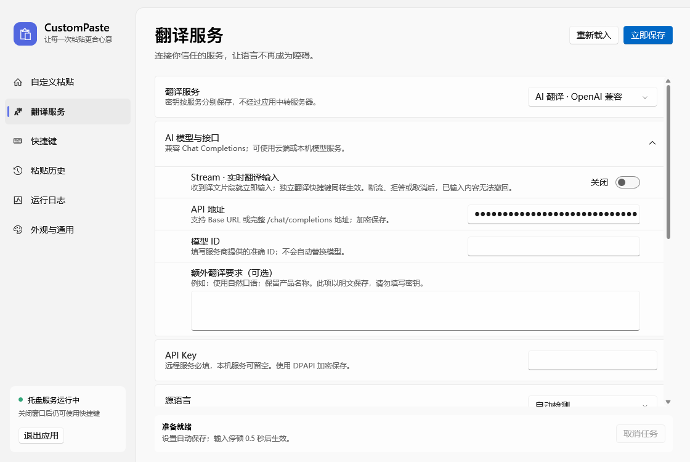
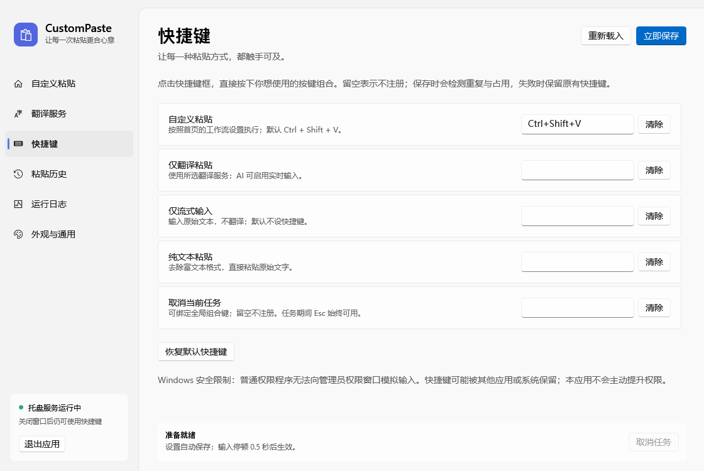

# CustomPaste

[](LICENSE)

**复制 → 转换 → 粘贴，把重复的文本处理交给一个快捷键。**

CustomPaste 是 Windows 托盘常驻的自定义粘贴工具：用 **Ctrl + Shift + V** 执行纯文本粘贴、翻译后粘贴、模拟逐字输入，或 AI 实时翻译输入。无需翻译时，不必配置任何 API。

基于 .NET 8、WPF 和 iNKORE.UI.WPF.Modern 0.10.2.1。

[界面预览](#界面预览) · [快速开始](#快速开始) · [选择工作流](#选择工作流) · [翻译服务配置](#翻译服务配置) · [常见问题](#常见问题) · [安全与兼容性](#安全与兼容性) · [开发与验证](#开发与验证)

## 界面预览

### 自定义粘贴

在首页组合「先翻译，再粘贴」与「流式输入」，调整输入间隔和剪贴板恢复选项。



<details>
<summary>查看 AI 翻译配置与独立快捷键</summary>

### AI 翻译配置

配置兼容接口、模型和额外翻译要求；需要边生成边输入时，开启「Stream · 实时翻译输入」。截图中的模型与密钥留空，使用前需填写自己的配置。



### 独立快捷键

不同动作可分别绑定，不必反复切换首页开关；默认只绑定自定义粘贴。



</details>

> 图片由项目自身的 WPF 离屏渲染工具生成，使用隔离测试数据，不包含真实密钥或剪贴板内容。示例展示浅色、纯色背景；实际系统材质和 DPI 效果以运行环境为准。

## 功能

- **自定义粘贴**：默认全局快捷键 **Ctrl + Shift + V**。可选择先翻译、逐字输入，或组合两者。两个开关都关闭时执行纯文本粘贴。
- **独立快捷键**：仅翻译粘贴、仅流式输入、纯文本粘贴、取消当前任务；默认不绑定。点击快捷键框录入，Backspace / Delete 清除。保存时检查重复和系统占用。
- **翻译**：DeepL API Free / Pro、Microsoft Translator Text API v3，可填写完整 URL 的 DeepLX，以及 OpenAI 兼容 AI 翻译（支持实时输入）。支持自动识别源语言及常用目标语言；每个服务分别保存 API Key。内置测试不会读取剪贴板。
- **历史**：默认开启，仅记录本应用已发送的最终文本；搜索、查看、复制、删除、清空，可限制 1–1000 条。关闭并保存时清空已有记录。
- **日志**：级别和关键字筛选，记录任务开始 / 结束 / 失败 / 取消、耗时、字符数、设置变更。界面展示本次运行最近 500 条，JSONL 文件保留 7 天，每天轮转至约 4 MB。**不记录文本正文、API Key 或服务商响应体**。
- **托盘运行**：关闭设置窗口不退出，双击托盘重新打开；托盘菜单可以查看历史、日志或取消任务。支持单实例及 `--background` 启动参数。
- **外观**：浅色、深色、跟随系统、强调色、Mica / Tabbed / 纯色；设置由 SettingsCard 和 SettingsExpander.Items 组织，并自动保存。材质在不受支持的系统上由 UI 库回退。

## 快速开始

### 1. 从源码运行

需要 Windows 和 **.NET 8 或更新 SDK**；运行编译后的应用需要 **.NET 8 Desktop Runtime**，仅安装普通 .NET Runtime 不够。可从 [.NET 8 下载页](https://dotnet.microsoft.com/zh-cn/download/dotnet/8.0) 获取。

在仓库根目录打开 PowerShell：

```powershell
dotnet build CustomPaste.sln -c Release
dotnet run --project CustomPaste/CustomPaste.csproj -c Release
```

只启动托盘、不显示设置窗口：

```powershell
dotnet run --project CustomPaste/CustomPaste.csproj -c Release -- --background
```

### 2. 先试一次纯文本粘贴

保留首页两个工作流开关为关闭状态，复制一小段普通文字，切换到记事本输入区，按 **Ctrl + Shift + V** 并松开按键，即可去除富文本格式后粘贴。默认快捷键如被其他程序占用，请在「快捷键」页更换组合键。

### 3. 按需启用翻译或逐字输入

1. 不需要翻译时，可直接开启首页「流式输入」，按设定间隔逐字输入原文。
2. 如需翻译，进入「翻译服务」，选择服务并填写自己的 API Key（DeepLX 填写完整接口地址，Bearer Token 可选），再选择目标语言。
3. 可点击「测试翻译」验证当前表单配置（会发送示例文本并消耗服务额度），配置会在输入停顿约 0.5 秒后自动保存。
4. 在首页启用需要的工作流，等待自动保存完成。复制文本，切换到目标输入框，按快捷键后松开按键。
5. **Esc** 可取消翻译 / 输入；也可在「快捷键 → 取消当前任务」额外绑定全局组合键（默认留空）。全局取消键还能取消设置页中的翻译测试，忙碌时优先响应；已发送部分不会撤回。粘贴期间修改设置会延后保存，任务结束后自动生效。

## 选择工作流

下面的组合适用于默认 **Ctrl + Shift + V**「自定义粘贴」动作：

| 想要的效果 | 首页「先翻译，再粘贴」 | 首页「流式输入」 | 补充设置与行为 |
| --- | --- | --- | --- |
| 去除格式，粘贴原文 | 关 | 关 | 无需翻译服务 |
| 模拟逐字输入原文 | 关 | 开 | 使用首页的输入间隔 |
| 翻译后一次性粘贴 | 开 | 关 | 先配置翻译服务；AI Stream 关闭 |
| 翻译完成后逐字输入 | 开 | 开 | 使用首页的输入间隔；AI Stream 关闭 |
| AI 边翻译边输入 | 开 | 任意 | 选择 AI 服务并开启 Stream；不额外等待逐字间隔 |

**普通「流式输入」是逐字模拟键盘输入，不是网络流式响应。** AI Stream 则在译文尚未完整生成时就开始输入，后续失败或取消不会撤回已发送内容。

「快捷键」页的独立动作不依赖首页组合：仅流式输入始终输入原文，纯文本粘贴始终直接粘贴原文，仅翻译粘贴使用当前翻译服务（AI Stream 开启时会实时输入）。

> 例如：复制一段外语说明，配置目标语言为简体中文后开启翻译，即可在目标输入框输出译文。翻译会将文本发送到你配置的服务，请勿用敏感内容试运行。

## 翻译服务配置

### AI 翻译（OpenAI 兼容）

1. 在「翻译服务」选择 **AI 翻译 · OpenAI 兼容**。
2. 填写 **API 地址** 和服务商提供的 **模型 ID**。默认地址是 OpenAI 的 Chat Completions 接口，不预设模型，不自动替换模型。
3. 填写对应服务的 **API Key**；只有本机回环服务允许留空。
4. 选择源语言 / 目标语言，可添加口吻、术语等额外要求。有效配置会自动保存；在首页开启「先翻译，再粘贴」。

地址支持完整 `/v1/chat/completions` 或 Base URL。例如 `https://your-host/v1` 会补成 `https://your-host/v1/chat/completions`；只有域名时补 `/v1/chat/completions`。完整路径不会重复追加，查询参数会保留。本机可使用 `http://localhost:1234/v1`，远程必须 HTTPS。API 地址和密钥经过 DPAPI 加密，模型 ID 和额外翻译要求为普通配置，**不要在额外要求中填写密钥**。

使用 Chat Completions 最小兼容请求：`model`、`messages`；Stream 关闭时 `stream: false`，开启时 `stream: true`（SSE）。翻译规则放在 system 消息，待翻译文本单独放在 user 消息，不执行工具、不发送历史对话；不添加可能与模型不兼容的采样和 token 参数。模型需支持文本输入、system 消息和标准 Chat Completions 输出。

非流式模式仅接受 `finish_reason: stop` 的完整文本；实时模式需要最终 `stop` 和 `[DONE]` 才算成功，只有成功后才记录完整历史。拒答、截断、过滤、工具调用、断流或空内容会停止处理，不会回退粘贴原文或思考内容。**实时输入在收到最终状态之前已经发送文本，因此后续失败或取消无法撤回已输入部分；不把部分结果标记为成功历史。**额外校验响应大小和译文字符数。AI 请求超时为 **90 秒**，可按 Esc 取消；不自动重试计费请求。Stream 关闭时完整译文到达后才粘贴；开启后仅提取 SSE `delta.content`，收到片段立即模拟 Unicode 输入，不额外等待逐字间隔，不修改剪贴板。支持跨网络字节边界的 UTF-8、跨片段 CRLF；不会输入 `reasoning_content`、拒答文字或工具调用参数。

这是协议兼容接入，不保证每个第三方服务均兼容。ChatGPT 网页地址、Anthropic 原生 Messages、Gemini 原生接口和 OpenAI Responses 地址不能直接填入，需要服务提供 Chat Completions 兼容端点。文本会发往配置的服务，AI 仍可能误译或未遵守格式，请核对结果；这里没有使用真实账户进行计费接口验证。

参考：[Chat Completions 官方 API 文档](https://developers.openai.com/api/reference/resources/chat/subresources/completions/methods/create)。选择此协议是为了第三方兼容性，不代表所有最新模型均支持相同参数。

### DeepLX 完整地址

在「翻译服务」选择 **DeepLX · 自定义接口**，将完整地址粘贴到「DeepLX 接口地址」，例如 `https://your-host/your-token/translate`。地址中已含令牌时，Bearer Token 通常留空；自建实例启用 `-token` 时，可填写对应 Bearer Token。不要把真实令牌写入源码或日志。

- 使用 DeepLX `/translate` JSON 协议：`text` 为字符串，`source_lang` 为 `auto` 或语言代码，`target_lang` 为目标语言代码；读取响应的 `code: 200` 和 `data`。不是官方 `/v2/translate` 数组协议。
- 简体中文映射 `ZH`，繁体映射 `ZH-HANT`（旧版本服务可能不支持繁体）。
- URL 路径和查询参数原样保留，不自动追加 `/translate`；地址在界面使用普通文本框显示，方便查看和编辑；保存时整条地址仍使用 DPAPI 加密。拒绝用户信息、片段及不安全协议；远程服务必须 HTTPS，本机回环实例可用 `http://localhost:1188/translate`。
- DeepLX 是第三方服务；译文请求会直接发送给所填 URL，请仅使用可信实例。未内置任何真实令牌或公共服务凭据。
- 如果出现 HTTP 429，表示接口或上游服务限流，并不一定是地址有误；按服务返回的 Retry-After 等待，避免连续点击测试。仅凭 429 无法确认令牌是否有效。
- 点击「测试翻译」会使用当前表单配置调用服务；成功后保存，再启用首页翻译开关。

### 翻译配置

| 服务 | 请求端点 | 鉴权 |
| --- | --- | --- |
| DeepL API Free | https://api-free.deepl.com/v2/translate | Authorization: DeepL-Auth-Key &lt;key&gt; |
| DeepL API Pro | https://api.deepl.com/v2/translate | 同上；网页版订阅不等同于 API 订阅 |
| Microsoft Translator | https://api.cognitive.microsofttranslator.com/translate?api-version=3.0 | Ocp-Apim-Subscription-Key；区域资源 / 多服务资源另填 Ocp-Apim-Subscription-Region |

DeepL 中文源语言归一化为 ZH，目标简体 / 繁体使用 ZH-HANS / ZH-HANT。Microsoft 使用 zh-Hans / zh-Hant。Microsoft 当前仅接入全球端点，不支持 Azure 中国区或自定义 / 私有网络端点。

网络调用直接发往服务商，禁用重定向，不自动重试计费请求；普通翻译请求全生命周期超时 30 秒（AI 为 90 秒），响应大小上限 1 MiB，源文 / 译文均校验长度。官方服务没有 API Key，AI 缺少模型 / 远程服务密钥，或 DeepLX 没有完整地址时，不会发起请求或回退粘贴原文。

## 常见问题

### 关闭窗口后，为什么快捷键仍然有效？

关闭设置窗口仅隐藏界面，程序继续驻留托盘。双击托盘图标重新打开设置；需要完全退出时，使用「退出应用」或托盘菜单中的退出项。

### 按快捷键没有反应，应该检查哪里？

先确认程序仍在运行、快捷键已成功保存且未被其他应用占用。复制非空文本，将焦点放在普通权限的记事本输入区，按下快捷键后松开修饰键；任务尚未结束时不会启动第二个任务。可在「运行日志」查看失败或取消原因。不要通过给应用提权来绕过目标程序的权限限制。

### 为什么设置没有立即生效？

编辑停顿约 0.5 秒后自动保存；无效配置不会覆盖已生效设置，任务进行中则延后保存。检查窗口底部状态，修正错误后等待自动保存，或点击「立即保存」重试。

### 翻译失败会把原文粘贴出去吗？

不会。缺少配置、网络错误或不完整响应都会停止任务。AI 实时模式可能已经输入部分译文，这些内容无法自动撤回，也不会作为成功历史保存。点击「测试翻译」会真实调用所配置的服务，并可能消耗额度。

### 为什么历史里没有其他应用复制的内容？

CustomPaste 不是全局剪贴板管理器，不会监听所有复制操作。历史默认只保存本工具成功完成任务后的最终文本；失败、取消或 AI 部分结果不计入成功历史。

## 安全与兼容性

- **只处理文本**，不支持自动翻译图片或富文本。没有监听或轮询全局剪贴板。
- 普通粘贴通过临时纯文本剪贴板 + SendInput Ctrl+V 实现。默认在 800 ms 后恢复原来的多格式剪贴板；若这期间产生新的复制操作，不覆盖新内容。慢速或远程应用可增加恢复延迟，或关闭恢复。
- 流式输入使用 Unicode SendInput，按文本元素分组，支持代理对 / 组合字符，并将 CRLF 统一为一次 Enter。该普通逐字模式不是网络流式响应。另有 AI 专用「Stream · 实时翻译输入」，开启后按服务返回的片段即时输入。
- **换行和 Tab 会模拟 Enter / Tab，可能发送消息或切换字段。请勿在终端、密码框、敏感表单中使用。**
- 检查前台顶层窗口，窗口改变后停止输入；同一窗口内切换输入框，以及前台检测与系统输入之间的极短竞态无法完全消除。
- Windows UIPI 不允许普通权限进程向管理员权限程序注入输入。应用不会主动提升权限。部分游戏、浏览器编辑器、远程桌面或自绘控件也可能不接受模拟输入。
- 日志中的「输入已发送」表示 Windows 接收了输入请求，不代表目标应用确认插入成功；请检查目标应用。取消及失败均不会撤回已输入内容。

## 自动保存与 AI 实时输入

- 开关、下拉框、快捷键、地址、密钥、模型和翻译要求都自动保存；文本编辑使用约 **500 ms 防抖**，不在每个按键后写文件。
- 无效数字、地址或冲突快捷键不会覆盖旧配置；底部提示保存失败原因。修正后再次自动保存，也可点击「立即保存」重试。
- 粘贴进行中保留待保存草稿，任务结束后自动生效。关闭设置窗口会尝试保存；「重新载入」只放弃尚未保存的更改，不撤销已经自动保存的配置。
- 关闭历史仍需要确认清空，避免自动保存导致无提示删除。翻译示例文本、历史搜索和日志筛选不是持久化设置，不触发保存。
- 在 AI 服务设置中启用 **Stream · 实时翻译输入**（默认关闭）。它作用于启用了翻译的自定义粘贴及独立翻译快捷键，优先于首页的普通流式输入开关。
- 实时输入仍检测目标顶层窗口变化、监听 Esc 并禁止任务并发。同窗口内输入焦点变化无法可靠检测；换行 / Tab 会模拟按键，勿用于终端、密码框或敏感表单。
- 实时模式最多等待 90 秒，单条 SSE 事件上限 256 Ki 字符，总流上限 16 Mi 字符，并继续限制最终文本长度。不支持 SSE 的接口会明确提示关闭 Stream，而不会悄悄改成等待整段回复。

## 数据与隐私

数据目录：`%LOCALAPPDATA%\CustomPaste`

- `settings.json`：设置及经过 Windows DPAPI CurrentUser 加密的 API Key / DeepLX 完整地址 / AI API 地址。
- `history.dat`：整份历史记录经过同一 Windows 账户的 DPAPI 加密；最终文本可能包含敏感信息，可关闭记录或清空。
- `Logs\YYYY-MM-DD.jsonl`：不含正文和密钥的诊断日志；界面的「打开日志目录」可查看以往运行日志。

DPAPI 防止文件被直接当作明文读取，**不防御已经在同一 Windows 账户下运行的恶意程序**。复制到其他账户 / 系统后可能无法解密，需要重新输入密钥。损坏配置尽可能备份为 settings.json.invalid-*，然后使用默认值。退出会等待正在执行的任务结束并释放托盘和快捷键资源。

## 开发与验证

不依赖额外测试框架的离线回归测试（不会调用付费 API 或向真实桌面输入）：

```powershell
dotnet build CustomPaste.sln -c Release
dotnet run --project CustomPaste.Tests/CustomPaste.Tests.csproj -c Release
```

测试项目是自定义控制台断言程序，必须通过 `dotnet run` 执行；`dotnet test` 不能替代这些回归断言。

覆盖：快捷键解析 / 规范化 / 去重、设置边界、DPAPI、原子保存、损坏恢复、历史裁剪 / 删除、日志落盘、DeepL / Microsoft 协议、HTTP 错误、无效响应、取消、长度限制，以及粘贴路由、组合模式、忙碌保护、失败不输入和关闭历史不写文件。

WPF 离屏渲染与绑定诊断（生成六个页面、DeepLX / AI 配置页及深色首页）：

```powershell
dotnet run --project CustomPaste.Tests/CustomPaste.Tests.csproj -c Release -- --render-ui artifacts/ui
```

检查生成的 PNG 和 `artifacts/ui/binding-diagnostics.txt`（正常应为空）。README 图片保存在 `docs/images/`，更新界面后可从渲染产物中选取并替换同名图片；不要提交 `artifacts/ui/test-data/` 等临时测试数据。

### 上线前手动验收

- 在记事本中测试中文、emoji、组合字符、CRLF、Tab；观察流式输入及 Esc 中止。
- 在真实目标应用中测试 Ctrl+Shift+V、快捷键重复 / 系统冲突、关闭窗口后的托盘行为。
- 用 HTML / RTF 剪贴板测试多格式恢复；在恢复等待期间复制另一段文字，确认新剪贴板不被覆盖。
- 翻译期间切换窗口、输入期间切换窗口，以及普通 / 提权窗口的权限限制。
- 填入真实服务商 Key 测试成功、额度不足、无效认证和网络超时。
- 重启后验证设置、历史和主题；确认关闭历史会清空记录。
- 在 Windows 10 / 11 以及 100% / 150% / 200% DPI 下检查窗口布局、材质及深浅色主题。

离线测试和离屏渲染不代替真实服务商、目标应用及系统材质的端到端验证。

## 结构

- Models：设置、语言选项、历史 / 日志条目。
- Services：设置与密钥存储、历史、日志、翻译、全局快捷键、粘贴编排与 Windows 输入适配层。
- SettingsWindow：六页设置界面与交互；配置采用可观察草稿，编辑停顿后自动校验、保存并生效；保留「立即保存」作为手动重试入口。
- App：单实例、服务装配、托盘和退出生命周期。
- CustomPaste.Tests：离线断言程序及离屏 UI 渲染。

## 参考文档

- [iNKORE Modern 简介](https://docs.inkore.net/zh-cn/ui-wpf-modern/introduction/)
- [iNKORE SettingsExpander 官方示例](https://github.com/iNKORE-NET/UI.WPF.Modern/blob/main/source/iNKORE.UI.WPF.Modern.Gallery/Pages/Controls/Community/SettingsExpanderPage.xaml)
- [DeepL 翻译 API](https://developers.deepl.com/api-reference/translate)
- [Microsoft Translator v3 Translate](https://learn.microsoft.com/en-us/azure/ai-services/translator/text-translation/reference/v3/translate)

- [DeepLX `/translate` 文档](https://deeplx.owo.network/endpoints/free.html)

## 许可证

本项目采用自定义 **NON-COMMERCIAL & SHARE-ALIKE LICENSE**，并非 MIT、Apache 或标准 Creative Commons 许可证。使用、修改和分发前请阅读 [LICENSE](LICENSE)，具体授权条件以原文为准；请保留版权与许可证文本。

# 感谢
感谢 [linux.do](https://linux.do/) 社区的宣传
